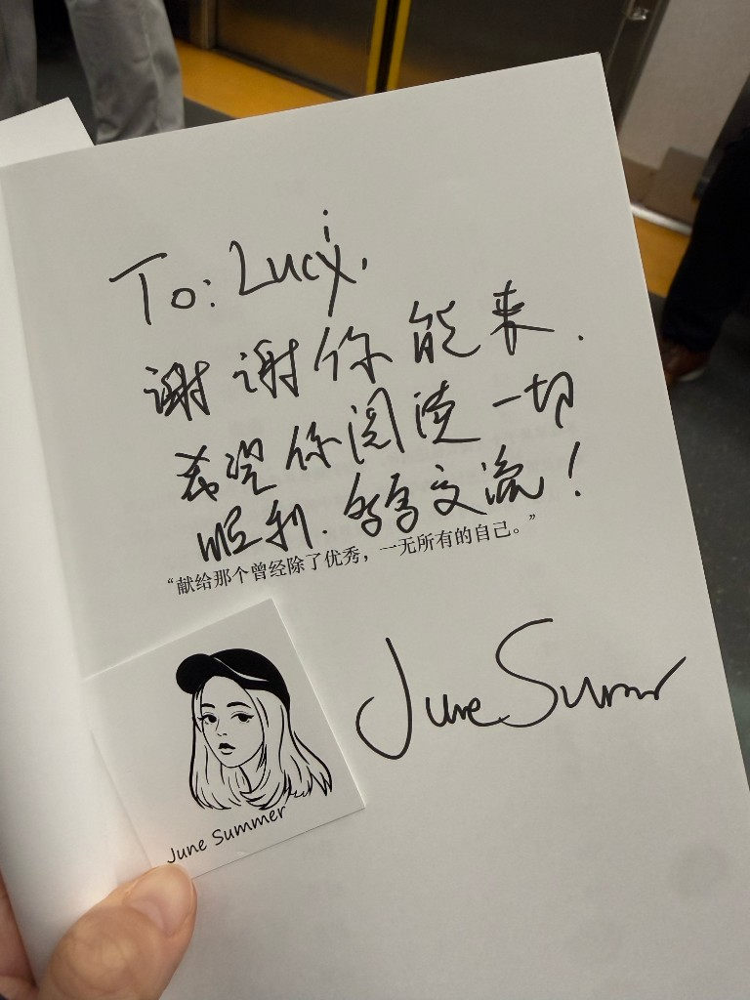
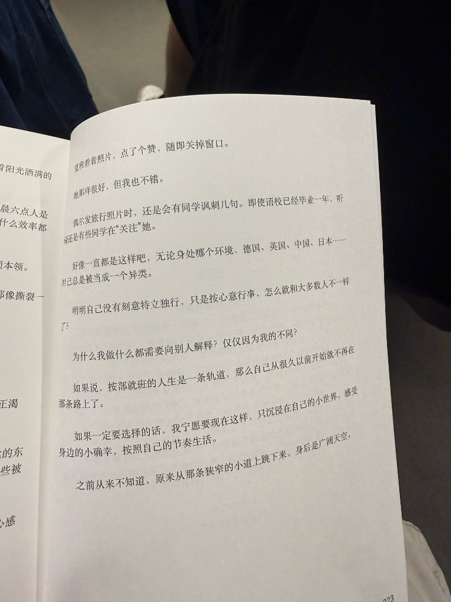
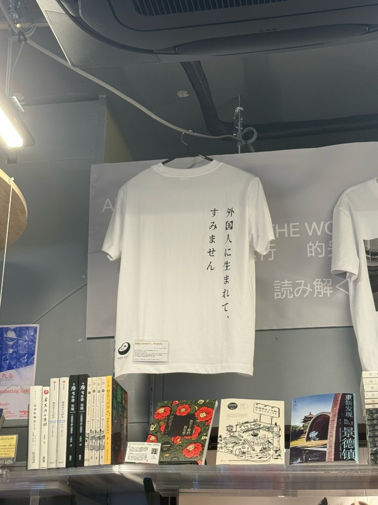

I went to two very interesting events.

The first one was a private screening of 《线》(line) by [病女 / Sickgirl](https://sickgirl.xyz/). I first saw her photography on Weibo in middle school, it felt magical. She dropped out in third grade of elementary school, and has always lived as a social outsider (I mean this in a neutral way).

The documentary is about her and her partner VT walking from South America all the way across the US-Mexico border, then getting sent back to China. Because of this, they couldn't leave China for two years. She came to Japan as soon as the ban was lifted. I was lucky enough to meet her.

When I was walking a dog in Queens, nyc, I met a Korean woman. She was born in Russia, got her status through asylum. She said asylum cases take a long time, she has a friend who's been here for 10 years without status. And before the case is decided, you have to stay in that state. If the verdict comes and you're not there, the case is void.

When I was getting a massage in Flushing, the massage lady also "walked" here from mexico. Listening to her, I felt like there's more than one way to live a life. Making money isn't easy for everyone.

I told sickgirl she has so many art projects, she could consider moving to Europe / doing an art residency. She said she wants to go to the US the most primitive way, by "walking", because that's how people from South America have been doing it for hundreds of years.

I found it fascinating. She mentioned that you have to solve what's going on inside you, otherwise no matter where you live or what language you speak, you'll want to escape. I asked her, have you solved yours? She said not completely, but much better.

The second one was a book sharing. The author June Summer went to high school, university, and grad school in Germany, then got another master's in the UK. She's doing independent publishing in Tokyo now. I think her path is amazing. She also talked about following your heart.

<figure>

<figcaption class="muted">June Summer signed my copy after the book sharing</figcaption>

</figure>

<figure>

<figcaption class="muted">From the book: OFF THE RAILS</figcaption>

</figure>

<figure>

<figcaption class="muted">This t-shirt says: being born as a foreigner I'm sorry 外国人に生まれて、すみません</figcaption>

</figure>

So what kind of life is a good one, a successful one? Should people use their privileges to put themselves above others, or to make this world a better, fairer place? 

Everybody's answer is different. As long as you can live with yourself, that's enough.

The reason I like big cities is that everyone & everything is connected. Anything is possible.