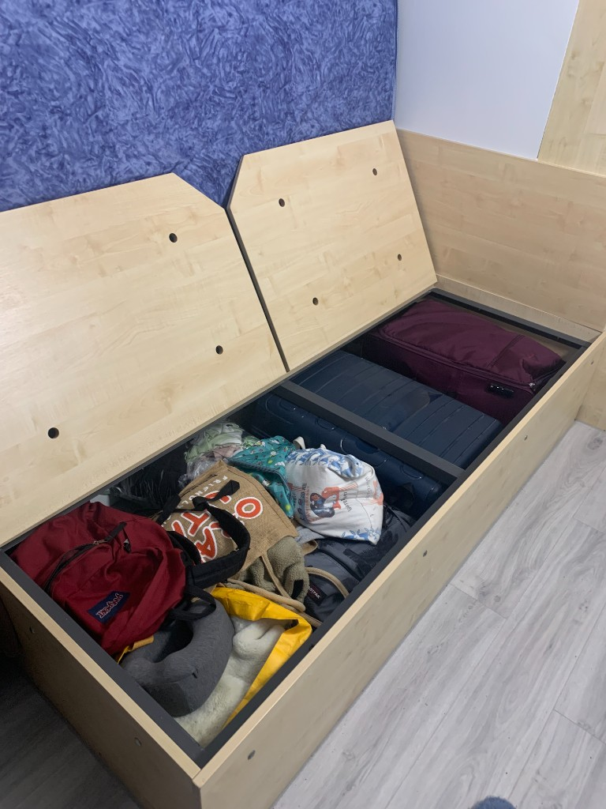
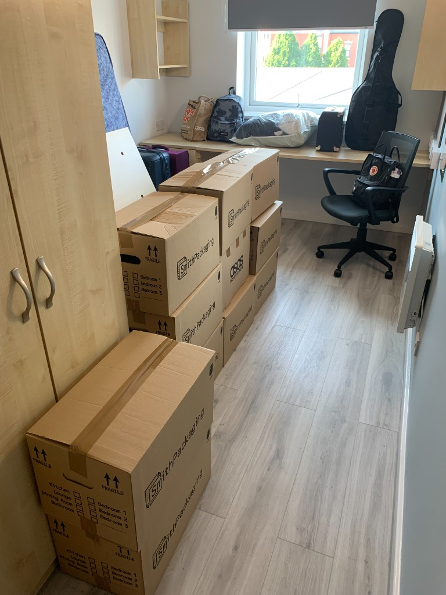
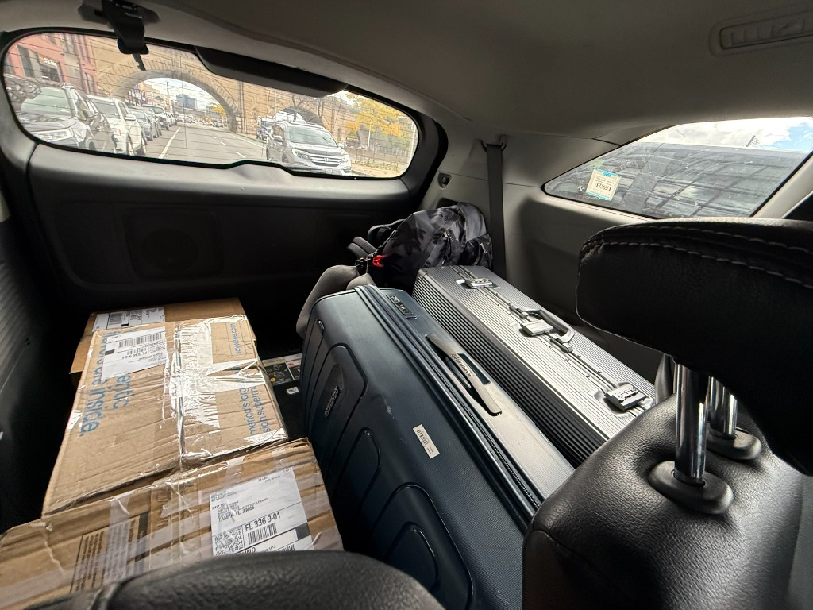

I want as few materialistic things as possible. When I moved to my summer stay in Liverpool, I carried more than 10 pieces of luggage with me. I stored them under my bed (and MANY other places)

This was my home when I was trying to move out of the summer stay. I had to skip work that day just to pack my things. Somehow they multiplied, 12+ pieces in total.

These were my things when I was on my way to LaGuardia Airport. Only 3 suitcases w/ 3 boxes, I later mailed the 3 boxes to Tampa, they arrived in 3 days.

Before leaving Tampa, I sold/ donated/ threw many things. I ended up only taking 3 suitcases plus one tote bag w/ me. Feeling relieved for not bringing things I don't need anymore with me, instead of spending big money to keep them.

Surprisingly, after arriving at my new home, I realized that I still have pieces that don't serve me anymore, then I sold them online, tried to benefit others.

One funny thing is that I took all the washing pods & drying sheets w/ me when I moved to Tokyo. I did the same thing when I moved to Tampa from nyc. It's good to have familiar smells around.

It's surprising how many things I thought I needed but never used. The things I like, the more I see & use them, the more I like them. The things I don't like that much, the more I see them the more I hate how much space they took up & how much energy they took from me.

I want to live with as few things as possible, thus I can enrich my experiences and carry them with me instead.
